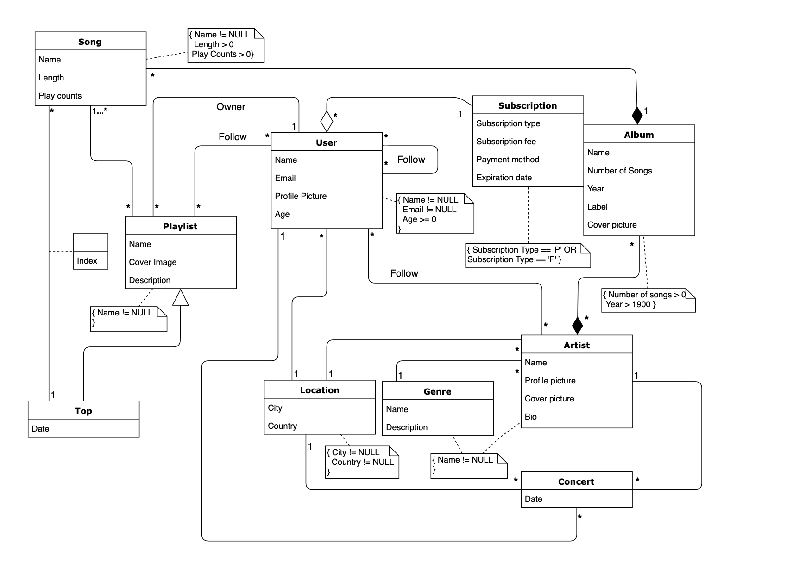

# BDAD

Project developed for the **Databases** class using SQLite3 database.

### Group 710
* André Mamprin Mori, up201700493@fe.up.pt
* Daniel Gazola Bradaschia, up201700494@fe.up.pt

## Project

The goal of the project was to [create](database/criar.sql) a database, [fill](database/povoar.sql) it with data, add [triggers](triggers/) and [query](queries/) it.

The topic chosen by the group was a **Music Streaming Service** (similar to Spotify, Apple Music).

More details about the project can be found at the final [report](final_report.pdf).

### Database

The UML Diagram of the database:

